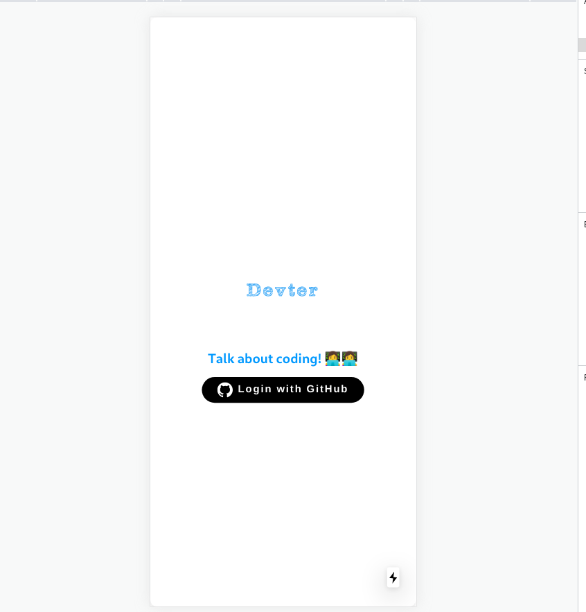
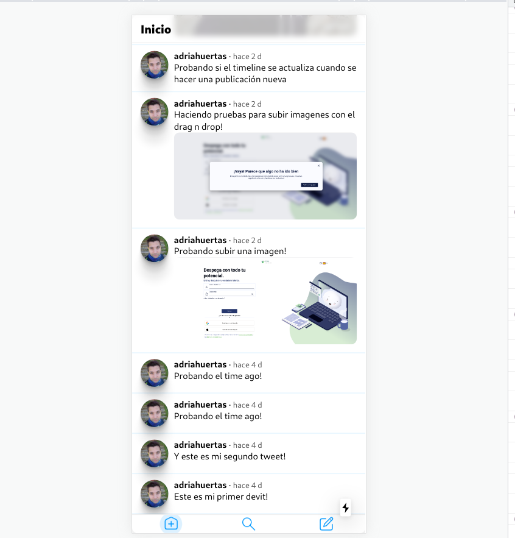
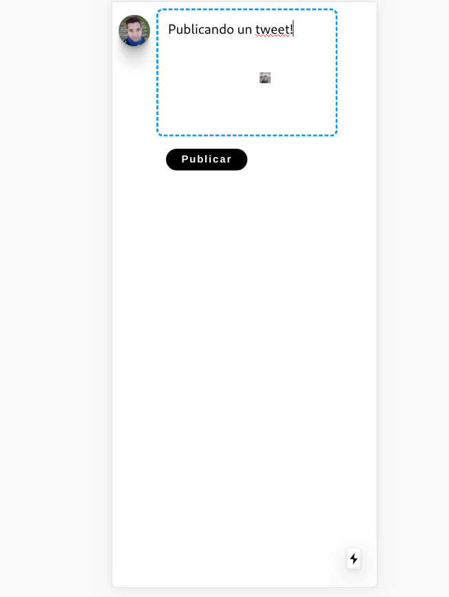
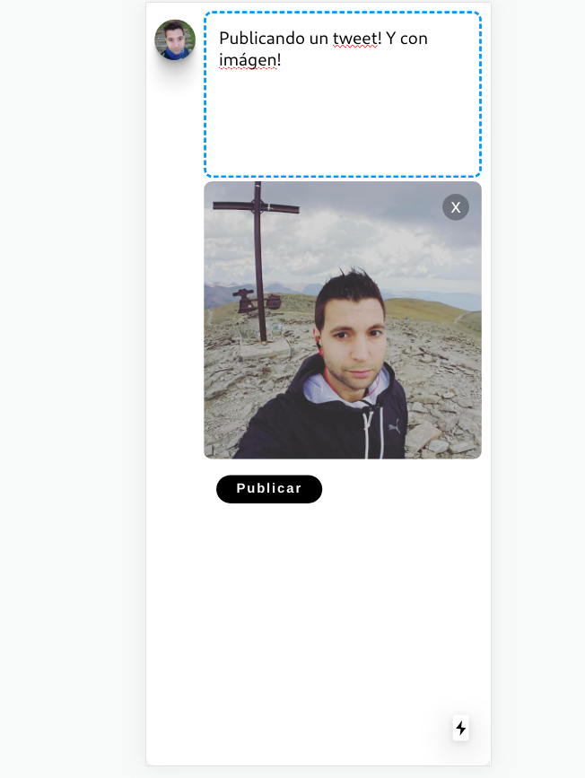
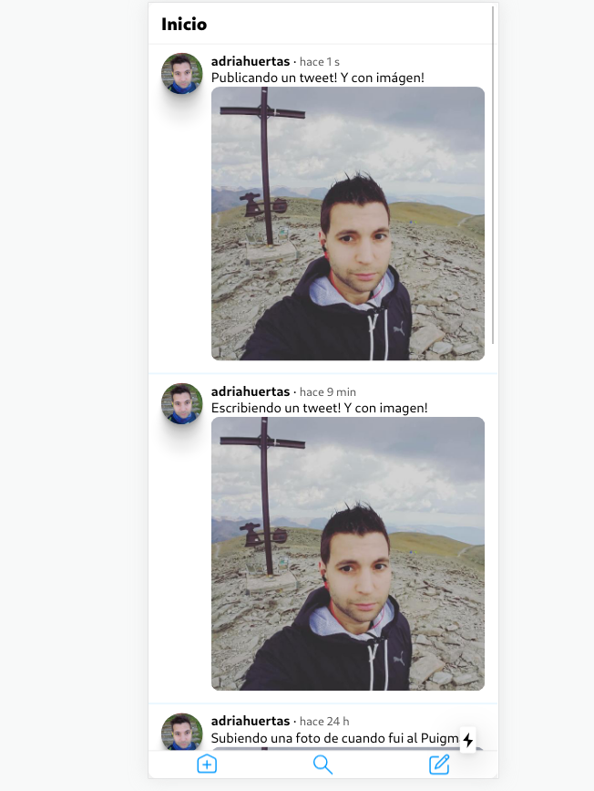

# next-react-app-demo

This is a demo application made with Nextjs/React. It's a twitter clone

## Features

- Design style: Mobile only
- Authentication with GitHub (Firebase)
- Realtime timeline
- Posting tweets route
- Posting images using drag and drop
- Images are stored in the cloud (Firebase storage)
- Tweets are stored in the cloud (Firebase database)
- Realtime Time ago in all tweets

## Screenshots

Home  

Timeline  

Publishing  

Adding an image  

Timeline after publishing  

## To Do

- Deployment
- Adding other authentication methods
- Searching
